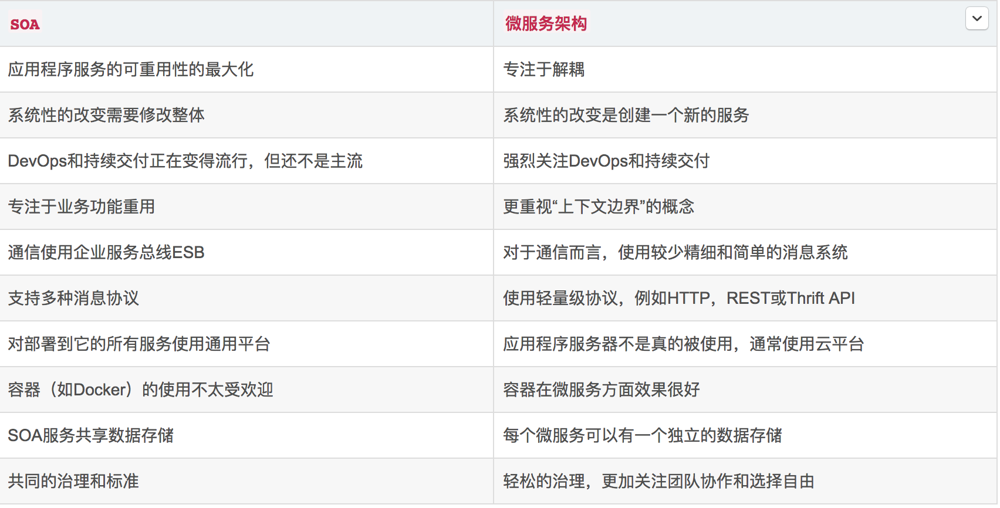

### 简介
微服务是soa架构的一个进化，微服务解决的是快速开发以及部署我们的服务，

### 重点知识

cap原则
```
Consistency 一致性
Availability    可用性
Partitiontolerance 分区容错性
```

指在一个分布式系统中，三者不可同时兼容

* 一致性C ：所有节点访问同一份最新的数据副本
* 可用性A ：在集群中一部分节点故障后，集群整体是否还能响应客户端的读写请求
* 分区容错性： 分区相当于与通信的时限要求，系统如果不能在时限内打成数据一致性，就意味着发生了分区的情况，必须在C与A之间做出选择


CAP理论就是说在分布式存储系统中，最多只能实现上面的两点。而由于当前的网络硬件肯定会出现延迟丢包等问题，所以分区容忍性是我们必须需要实现的。所以我们只能在一致性和可用性之间进行权衡，没有NoSQL系统能同时保证这三点。


BASE就是为了解决关系数据库强一致性引起的问题而引起的可用性降低而提出的解决方案。

BASE是下面三个术语的缩写：

* 基本可用（Basically Available）
* 软状态（Soft state）
* 最终一致（Eventually consistent）


### 例子：
拜占庭将军问题
 莱斯利·兰波特（Leslie Lamport）于 1982 年提出用来解决一直行问题的一个虚构模型，拜占庭由于地域宽广，守卫边境的多个将军需要通过信使来传递消息，达成某个一致的决定，但是将军中会存在叛徒，这些叛徒会努力向不同的其他人发出消息，试图干扰一些决策，对于拜占庭问题来说，假如节点总数为 N，叛变将军数为 F，则当N>3F+1时，问题才有解，这个就是拜占庭问题。解决的是网络可靠，但是节点可能故障下的一致性该如何达成的问题。


### soa-微服务


### 皓哥推荐的架构

前端： react.js/vue.js
后端：go+go kit
通讯：grpc 比restful快20倍到50倍
Api：Swagger
网关：Envoy包含了服务发现、负载均衡和熔断
日志监控：ELK+fluentd
指标监控：Prometheus
调用跟踪：Jaeger或者Zipkin
自动化运维：Docker + Kubernetes