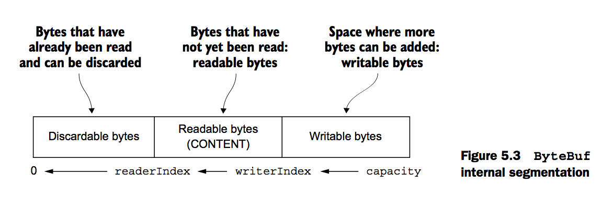
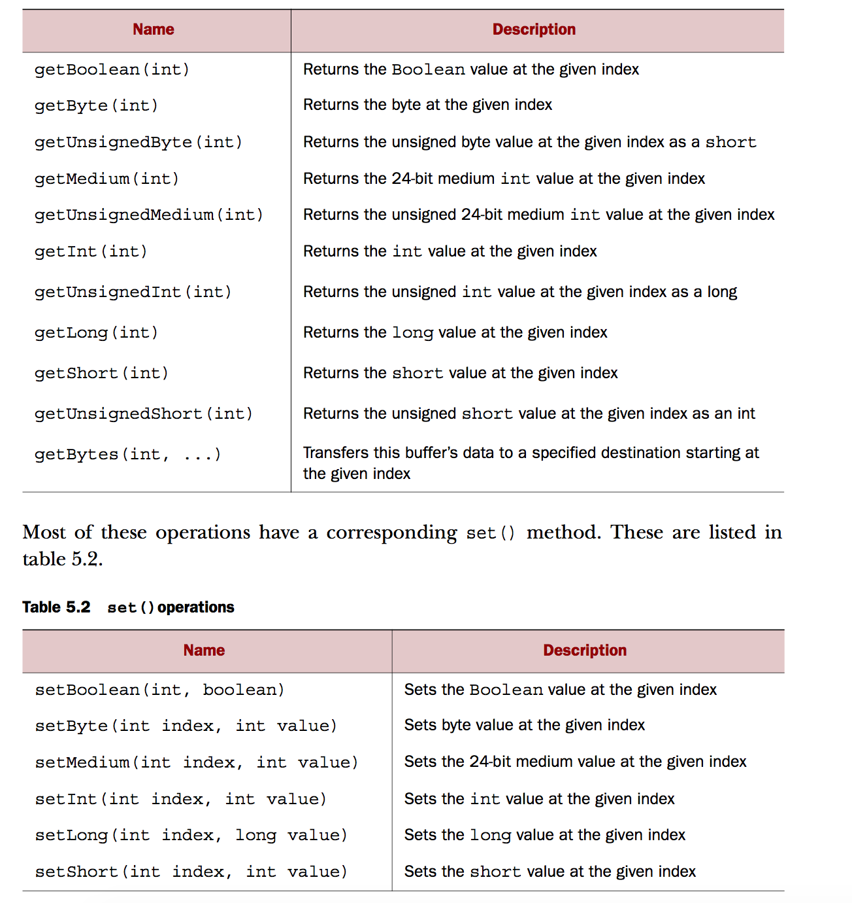
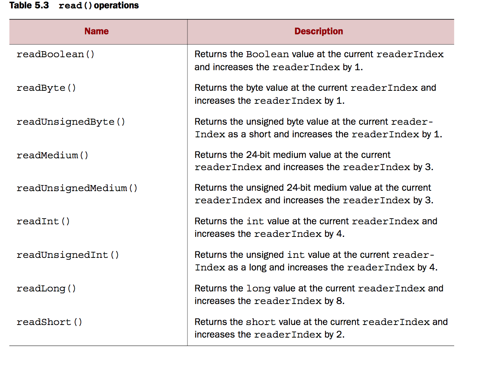
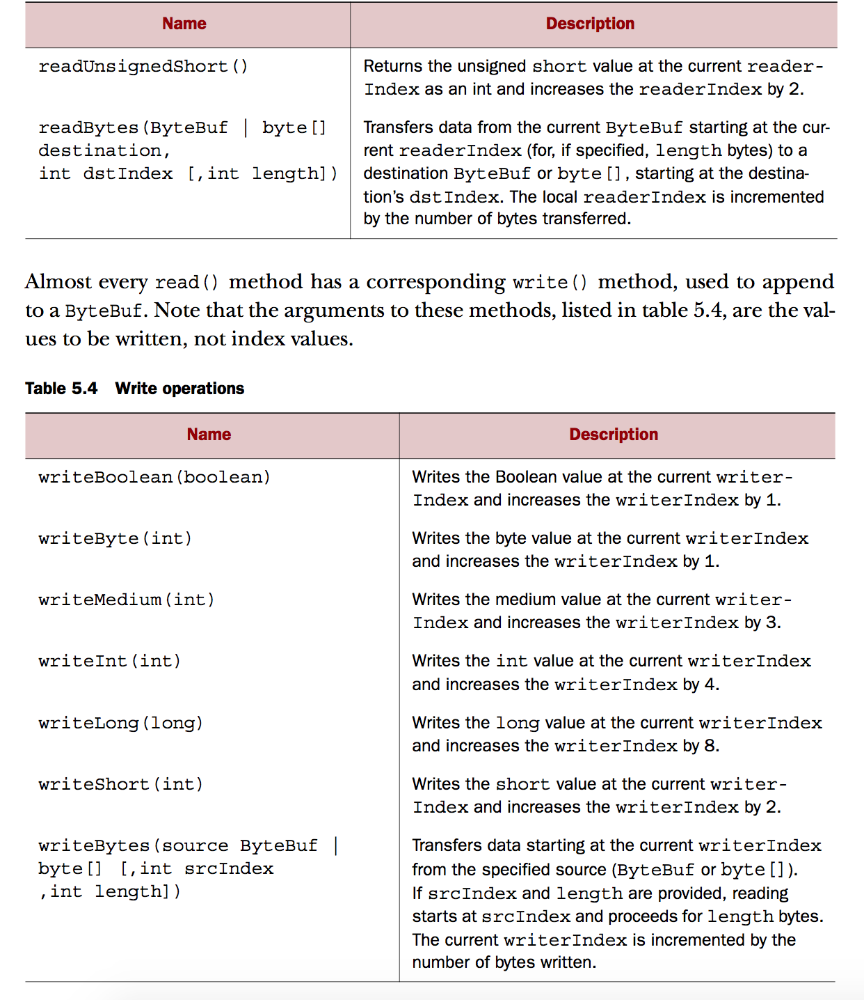
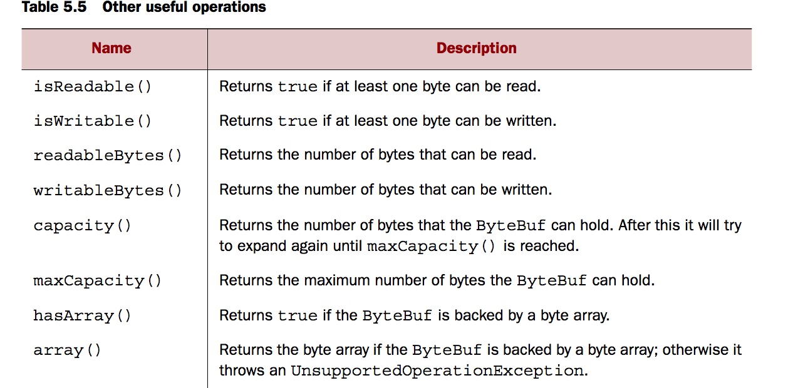
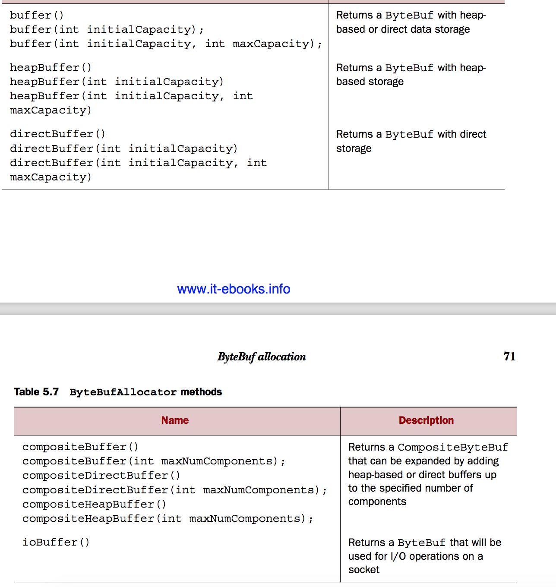
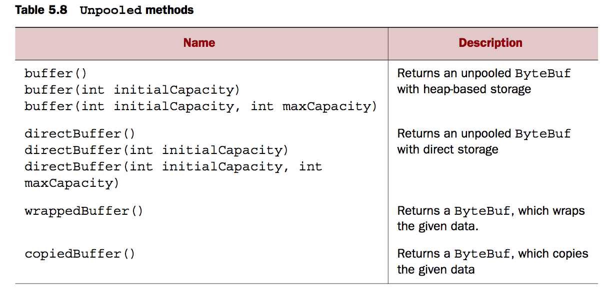

### 简介
这章主要讲解数据的容器-ByteBuf ,以及相关的Api细节、使用用例和内存分配

网络数据的基础单元总是byte（字节），jva nio 提供ByteBuffer作为字节的容器，但是这个类使用比较负责，而且用起来很笨重

netty提供了ByteBuf来承担这一个责任，更加好的API使用

###ByteBuf API
netty API暴露了两部分 abstract class ByteBuf和 interface BYteBufHolder

* 可扩展用户自定义的buffer类型
* 透明的零复制通过内置的组成buffer 类型
* 可以根据要求扩展容量
* 读写切换不需要调用类似于ByteBuffer's flip()方法
* 读写使用不同的索引
* 可以链式调用方法
* 相关计数支持
* 支持池

#### ByteBuf 怎么工作
* ByteBuf有两个索引，一个读索引，一个写索引，当超出正常的索引范围，会触发IndexOutOfBoundsException
* ByteBuf最大的容量是Integer.MAX_VALUE

#### ByteBuf使用模式
##### HEAP BUFFERS
顾名思义：使用堆内存进行存储的buffer，在内存中作为一个backing array

优点：
    分配，以及回收很快
    使用java GC

##### DIRECT BUFFERS
使用直接内存分配的buffer，就是使用本地的Api

优点：
    避免在本地I/O操作前后，拷贝buffer内容到中间状态
    通过引用计数来进行释放

缺点：
    获取、回收比较昂贵

##### Composite Buffers
这个模式聚合了多个ByteBufs,你可以添加或删除你需要的ByteBuf,对外表示一个single

例如一个响应分为header 与body 就可以构建一个Composite Buffers，轻松实现

#### Byte 级别的操作
##### 随机根据索引获取
```
ByteBuf buffer = ...;
        for (int i = 0; i < buffer.capacity(); i++) {
            byte b = buffer.getByte(i);
           System.out.println((char) b);
       }

```
##### 序列存取数据
ByteBuf有两个读、写索引


##### discardable bytes
表示已经读取过的数据，通过执行read操作，可以通过调用discardReadBytes()来丢弃。

一般不建议经常使用，可能导致内存拷贝，这时候内容部分已经移到开头了，通常，只有当内存很稀缺

##### Readable bytes
通常这部分存储真正的内容，readerIndex通常从0开始，你可以读取或者跳过等。

读取全部数据
```
ByteBuf buffer = ...;
while (buffer.isReadable()) {
    System.out.println(buffer.readByte());
}

```

##### Writable bytes
表示的是准备写入的区域，任意写入的操作都将会使writeIndex增加，

写入
```
ByteBuf buffer = ...;
while (buffer.writableBytes() >= 4) {
    buffer.writeInt(random.nextInt());
}
```

##### Index Management
 ByteBuf readerIndex and writerIndex 通过调用 markReaderIndex(), markWriterIndex(), resetReaderIndex(), and reset- WriterIndex()重置读或者写索引 ，   readerIndex(int) 或者 writerIndex(int)都会将索引设置，因此请小心设置，可以通过调用clear()将读、写索引设置为0


##### 搜索操作
通常可以用IndexOf()判断在哪个位置，复杂搜索可以使用ByteBufProcessor，这个借口定义了很多有用的方法，例如：
```
forEachByte(ByteBufProcessor.FIND_NUL)
```

##### 获取 buffers
以下操作都会返回新的buffer，但是底层依然是源ButeBuf，所以修改新Buffer会导致源变化
```
duplicate()
slice()
slice(int, int)
Unpooled.unmodifiableBuffer(...)
order(ByteOrder)
readSlice(int)
```

如果想深度拷贝，可以使用copy() 方法

```
Charset utf8 = Charset.forName("UTF-8");
ByteBuf buf = Unpooled.copiedBuffer("Netty in Action rocks!", utf8);
ByteBuf copy = buf.copy(0, 14);
System.out.println(copy.toString(utf8));
buf.setByte(0, (byte)'J');
assert buf.getByte(0) != copy.getByte(0);
```

##### 读写操作
get() set() 不会改变索引
read() write() 会改变索引







##### 更多的操作



### 接口ByteBufHolder
定义了一个可以实现自己的属性的接口，例如一个http请求中，多个属性，就可以使用ByteBufHolder来实现

### ByteBuf allocation
本节主要讲述怎么管理ByteBuf的实例

#### ByteBufAllocator
为了减少分配、以及回收的成本，netty使用了池化的ByteBufAllocator接口

提供了两种实现：ByteBufAllocator: PooledByteBufAllocator and UnpooledByteBufAllocator.
顾名思义，前者每次使用已有的对象，后者每次返回一个新的对象



#### 非池化的 buffers(Unpooled)
许多情况下我们并没有ByteBufAllocator的相关引用，netty提供了一个工具类，使用静态方法提供ByteBuf的实例



#### 工具类 ByteBufUtil
用于操作ByteBuf，例如比较equal()  ,打印 hexdup()成16进制的信息


### 引用计数 Reference counting
引用计数是一个用于优化内存使用的技术，通过一个对象当其他对象不在拥有它的引用时，从而释放资源，netty是在版本4的时候实现的，使用ByteBuf、ByteBufHolder

netty通过实现接口，interface ReferenceCounted，引用计数主要用于池化对象的释放，避免过大的内存消耗

```
Channel channel = ...;
ByteBufAllocator allocator = channel.alloc();
....
ByteBuf buffer = allocator.directBuffer();
assert buffer.refCnt() == 1;


ByteBuf buffer = ...;
boolean released = buffer.release();

```

当对象被释放了，再使用，会导致IllegalReferenceCountException.


