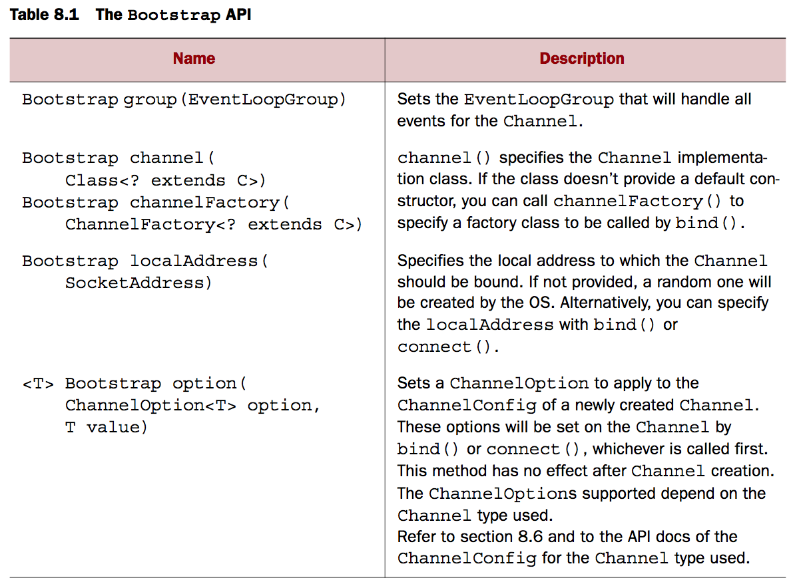
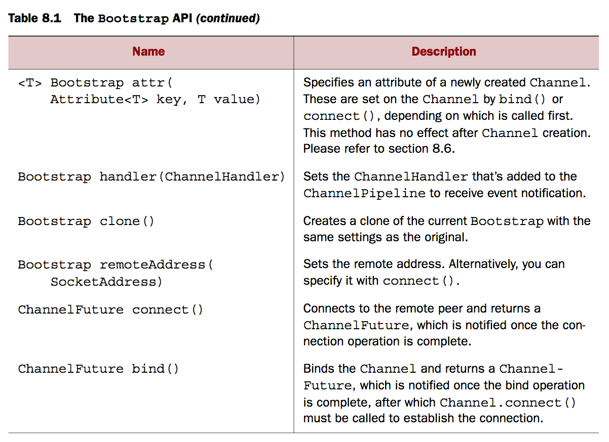
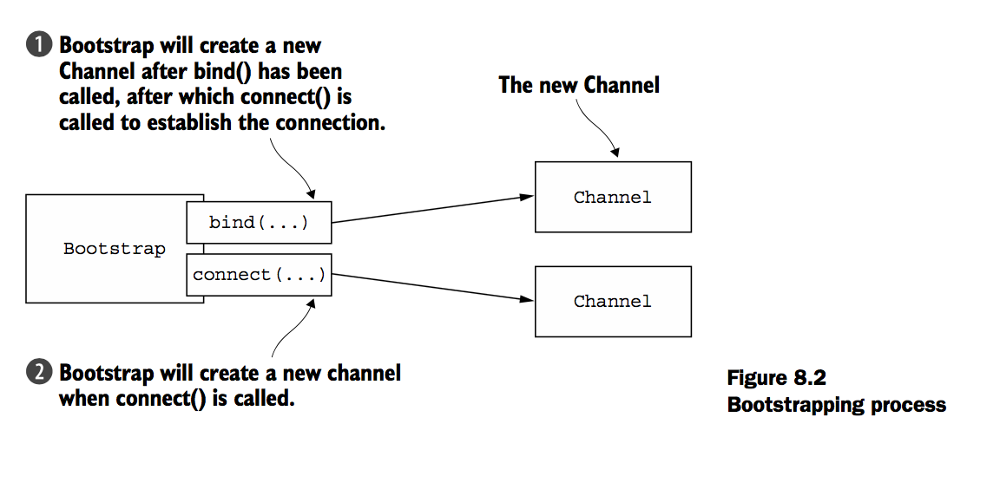
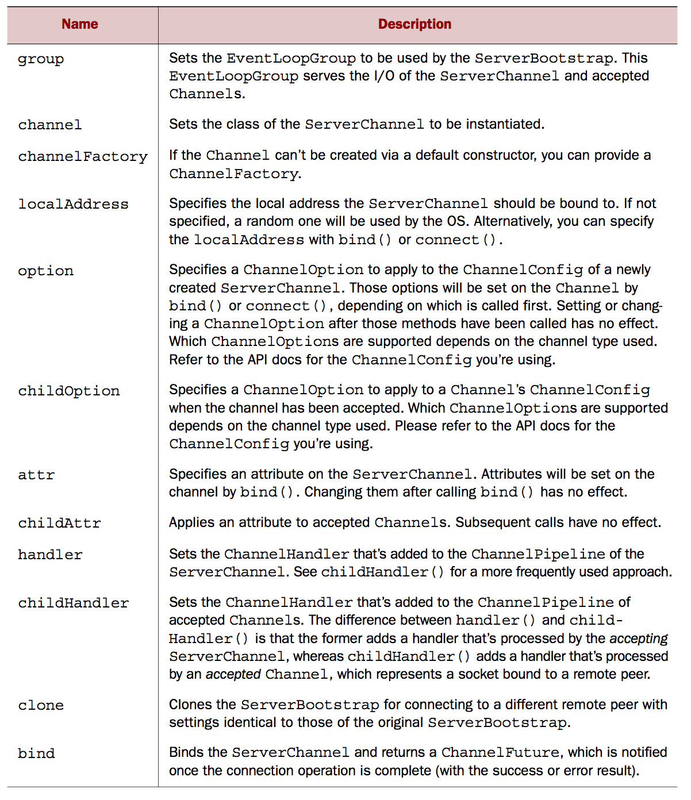
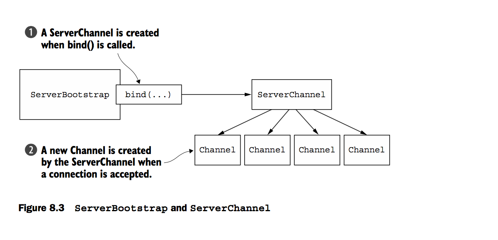

本章主要覆盖以下方面
* Bootstraping 客户端与服务端
* 在一个channle中的Bootstraping 客户端
* 添加channelHandlers
* 使用ChannelOptions以及属性


### Bootstrap 类
一个server端的Bootstrap，如上图所示，主要用于接收连接，并且创建一个子Channels与客户端服务，然而客户端只需要一个，因此不需要父级的channel。对于udp的服务端也一样如此

```
public abstract class AbstractBootstrap
            <B extends AbstractBootstrap<B,C>,C extends Channel>


 public class Bootstrap
            extends AbstractBootstrap<Bootstrap,Channel>

 public class ServerBootstrap
            extends AbstractBootstrap<ServerBootstrap,ServerChannel>

```

### Bootstraping 客户端以及无连接协议
以下是Bootstraping的API





#### 引导客户端
Bootstrap 类主要负责为客户端创建channels以及为应用指定连接协议




例如以下为使用NIO TCP连接

```
EventLoopGroup group = new NioEventLoopGroup();
Bootstrap bootstrap = new Bootstrap();
//Sets the EventLoopGroup that provides EventLoops for processing Channel events
bootstrap.group(group)
         .channel(NioSocketChannel.class)
    .handler(new SimpleChannelInboundHandler<ByteBuf>() {
        @Override
        protected void channeRead0(
            ChannelHandlerContext channelHandlerContext,
            ByteBuf byteBuf) throws Exception {
            System.out.println("Received data");
} } );
ChannelFuture future = bootstrap.connect(
    new InetSocketAddress("www.manning.com", 80));
    //Specifies the Channel implementation to be used
    //Sets the handler for Channel events and data
    //Connects to the remote host
         
future.addListener(new ChannelFutureListener() {
    @Override
    public void operationComplete(ChannelFuture channelFuture)
        throws Exception {
        if (channelFuture.isSuccess()) {
            System.out.println("Connection established");
        } else {
            System.err.println("Connection attempt failed");
            channelFuture.cause().printStackTrace();
        }
} } );


```

#### Channel 与 EventLoopGroup 组合
channel与EventLoopGroup要对应起来，是NIO的channel就要对应NIo的EventLoopGroup

当Bootstrap bind() 或者 connect() 的时候，一定要先设置以下三项

* group()
* channel() 或者 channelFactory()
* handler


### Bootstrapping 服务端 
这一节主要讲述Bootstrapping 服务端的相关APi以及使用用例



#### 
你可以发现服务端的Bootstrapping与客户端存在差别，例如childHandler，childAttr以及childOption，以上这些操作传统的server应用都有，特别是ServerChannel要实现创建相关的子channel，主要用于已经接入的连接。所以ServerChannel管理一些数量的子channel

下图为例：




```
NioEventLoopGroup group = new NioEventLoopGroup();
ServerBootstrap bootstrap = new ServerBootstrap();
//Sets the EventLoopGroup that provides EventLoops for processing Channel events
bootstrap.group(group)
     .channel(NioServerSocketChannel.class)
.childHandler(new SimpleChannelInboundHandler<ByteBuf>() {
    @Override
    protected void channelRead0(ChannelHandlerContext ctx,
              ByteBuf byteBuf) throws Exception {
        System.out.println("Received data");
    }
} );
//Sets a ChannelInboundHandler for I/O and data for the accepted channels

ChannelFuture future = bootstrap.bind(new InetSocketAddress(8080));
future.addListener(new ChannelFutureListener() throws Exception {
    @Override
    public void operationComplete(ChannelFuture channelFuture){
//Binds the channel with the configured bootstrap
   } } );

if (channelFuture.isSuccess()) {
    System.out.println("Server bound");
} else {
    System.err.println("Bound attempt failed");
    channelFuture.cause().printStackTrace();
}
```

### 从channle中引导客户端
如果你的程序既有服务，又有客户端场景，因此我们可能需要创建Bootstrap的客户端，由此连接到远程peer，但是这个是最没有效率的解决方法，这种方法可能需要你定义另一个EventLoop，这样就会产生额外的线程，以及上下文切换。
一个更好的方法是共享已经介入的channel的EventLoop，通过Bootstrap的group方法，因为所有的channles斗湖被分配到一个EventLoop使用同样的线程，这避免了额外的线程创建。

如下图所示：
 

```
public class BootstrapSharingEventLoopGroup {

    /**
     * Listing 8.5 Bootstrapping a server
     * */
    public void bootstrap() {
        ServerBootstrap bootstrap = new ServerBootstrap();
        bootstrap.group(new NioEventLoopGroup(), new NioEventLoopGroup())
            .channel(NioServerSocketChannel.class)
            .childHandler(
                new SimpleChannelInboundHandler<ByteBuf>() {
                    ChannelFuture connectFuture;
                    @Override
                    public void channelActive(ChannelHandlerContext ctx)
                        throws Exception {
                        Bootstrap bootstrap = new Bootstrap();
                        bootstrap.channel(NioSocketChannel.class).handler(
                            new SimpleChannelInboundHandler<ByteBuf>() {
                                @Override
                                protected void channelRead0(
                                    ChannelHandlerContext ctx, ByteBuf in)
                                    throws Exception {
                                    System.out.println("Received data");
                                }
                            });
                        bootstrap.group(ctx.channel().eventLoop());
                        connectFuture = bootstrap.connect(
                            new InetSocketAddress("www.manning.com", 80));
                    }

                    @Override
                    protected void channelRead0(
                        ChannelHandlerContext channelHandlerContext,
                            ByteBuf byteBuf) throws Exception {
                        if (connectFuture.isDone()) {
                            // do something with the data
                        }
                    }
                });
        ChannelFuture future = bootstrap.bind(new InetSocketAddress(8080));
        future.addListener(new ChannelFutureListener() {
            @Override
            public void operationComplete(ChannelFuture channelFuture)
                throws Exception {
                if (channelFuture.isSuccess()) {
                    System.out.println("Server bound");
                } else {
                    System.err.println("Bind attempt failed");
                    channelFuture.cause().printStackTrace();
                }
            }
        });
    }
}

```

**主要是无论什么时候都要考虑重用EventLoop**

### 在一个bootstrap中添加多个ChannelHandler
上文所示主要是使用handler与childHandler中只能绑定一个ChannelHandler，如何绑定多个呢？

答案是使用netty提供的一个ChannelInboundHandlerAdapter 的子类ChannelInitializer这个类
```
public abstract class ChannelInitializer<C extends Channel>
            extends ChannelInboundHandlerAdapter


        //使用这个方法
        protected abstract void initChannel(C ch) throws Exception;
```

当有channle绑定到EvnetLoop的时候，这个initChannel方法就会调用，然后在方法完成后，会将自己从ChannelPipeline中去除

```
public class BootstrapWithInitializer {

    /**
     * Listing 8.6 Bootstrapping and using ChannelInitializer
     * */
    public void bootstrap() throws InterruptedException {
        ServerBootstrap bootstrap = new ServerBootstrap();
        bootstrap.group(new NioEventLoopGroup(), new NioEventLoopGroup())
            .channel(NioServerSocketChannel.class)
            .childHandler(new ChannelInitializerImpl());
        ChannelFuture future = bootstrap.bind(new InetSocketAddress(8080));
        future.sync();
    }

    final class ChannelInitializerImpl extends ChannelInitializer<Channel> {
        @Override
        protected void initChannel(Channel ch) throws Exception {
            ChannelPipeline pipeline = ch.pipeline();
            pipeline.addLast(new HttpClientCodec());
            pipeline.addLast(new HttpObjectAggregator(Integer.MAX_VALUE));

        }
    }
}

```
### 使用netty 的ChannelOptions以及attributes
手动配置每个channel是单调乏味的。我们可以使用option()方法对Bootstrap配置ChannelOptions，ChannelOptions提供了相关keep-alive、timeout以及buffer的设置等。


```
public class BootstrapClientWithOptionsAndAttrs {

    /**
     * Listing 8.7 Using attributes
     * */
    public void bootstrap() {
        final AttributeKey<Integer> id = AttributeKey.newInstance("ID");
        Bootstrap bootstrap = new Bootstrap();
        bootstrap.group(new NioEventLoopGroup())
            .channel(NioSocketChannel.class)
            .handler(
                new SimpleChannelInboundHandler<ByteBuf>() {
                    @Override
                    public void channelRegistered(ChannelHandlerContext ctx)
                        throws Exception {
                        Integer idValue = ctx.channel().attr(id).get();
                        // do something with the idValue
                    }

                    @Override
                    protected void channelRead0(
                        ChannelHandlerContext channelHandlerContext,
                        ByteBuf byteBuf) throws Exception {
                        System.out.println("Received data");
                    }
                }
            );
        bootstrap.option(ChannelOption.SO_KEEPALIVE, true)
            .option(ChannelOption.CONNECT_TIMEOUT_MILLIS, 5000);
        bootstrap.attr(id, 123456);
        ChannelFuture future = bootstrap.connect(
            new InetSocketAddress("www.manning.com", 80));
        future.syncUninterruptibly();
    }
}
```

### 引导一个UDP的channels  DatagramChannels
前面的channel例子都是基于Tcp的，但是netty也提供了UDP的实现，区别主要在于connnect以及bind

···
 public void bootstrap() {
        Bootstrap bootstrap = new Bootstrap();
        bootstrap.group(new OioEventLoopGroup()).channel(
            OioDatagramChannel.class).handler(
            new SimpleChannelInboundHandler<DatagramPacket>() {
                @Override
                public void channelRead0(ChannelHandlerContext ctx,
                    DatagramPacket msg) throws Exception {
                    // Do something with the packet
                }
            }
        );
        ChannelFuture future = bootstrap.bind(new InetSocketAddress(0));
        future.addListener(new ChannelFutureListener() {
            @Override
            public void operationComplete(ChannelFuture channelFuture)
               throws Exception {
               if (channelFuture.isSuccess()) {
                   System.out.println("Channel bound");
               } else {
                   System.err.println("Bind attempt failed");
                   channelFuture.cause().printStackTrace();
               }
            }
        });
    }
}
···


### 关闭
如何优雅的关闭

```
EventLoopGroup group = new NioEventLoopGroup();
Bootstrap bootstrap = new Bootstrap();
bootstrap.group(group)
      .channel(NioSocketChannel.class);
...
Future<?> future = group.shutdownGracefully();
// block until the group has shutdown
future.syncUninterruptibly()
```

不建议：可选的，你可以使用channel.close() 确定关闭所有活跃的channel，然后再关闭EventLoop。

但是在所有的例子中，记住先关闭EventLoop


 


