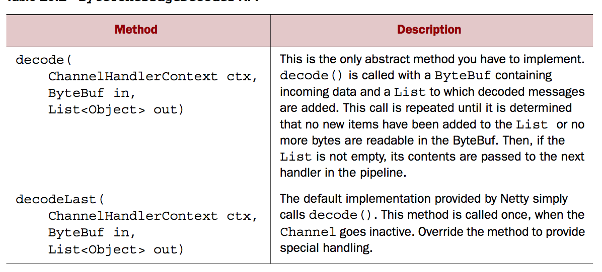
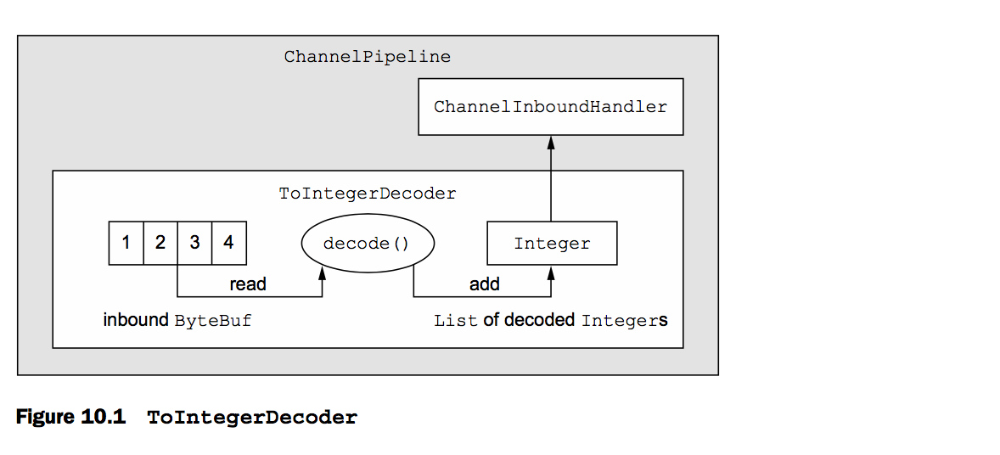
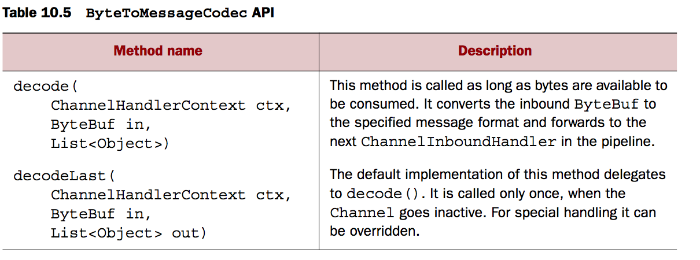
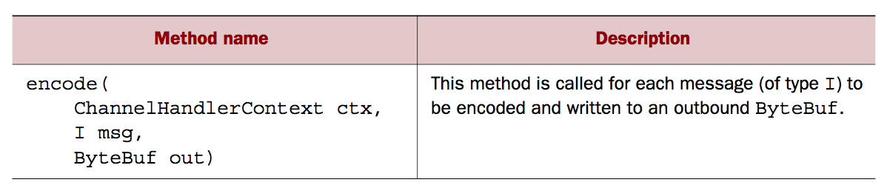
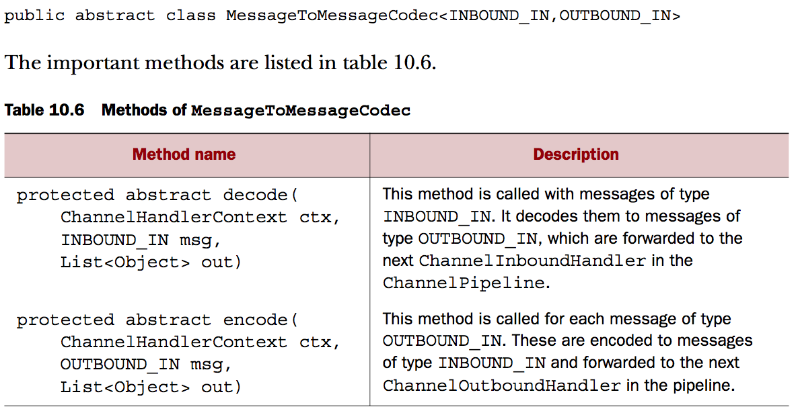

### 简介
这章主要介绍编码、解码、编解码的一些概述以及netty的编解码类

一些好的标准设计模式有框架支持，共同的数据处理模式通常是作为一个好的目标实现的，这些并将帮助开发者考虑时间与努力


### 什么是codec
每个网络应用都定义了如何将原始字节数据转换、或者解析为目标应用程序所需要的数据格式。这种转换逻辑通常是有codec决定的，codec是由编码与解码组成的，每一个转换流字节数据从一种形式到另一种的转换，怎么辨别他们。

考虑到消息是作为一系列有结构的字节数据，通常意味着一个特指的应用它的数据。大多数都像字节流。相应的解码转换网络上的流数据到应用的消息格式。一个编码，然后通过出站数据进入一个入站的解码数据。

#### Decoders
这部分我们主要调查netty的解码类以及使用相关的具体用例解释什么时候怎么使用它们，这些类主要覆盖两种不通的使用用例

* 解码字节-> message ：ByteToMessageDecoder、ReplayingDecoder
* 解码一种消息到另一种消息 ： MessageToMessageDecoder

因为解码器通常主要是入站数据的转换，它将实现ChannelInboundHandler

当你将要使用一个Decoder，很简单，无论什么时候，你都需要转换一个入站数据到下一个CHannelInboundHandler在整个Pipeline，更远的，感谢ChannelPipeline，你可以使用链状连接多个解码器实现复杂的转换逻辑。一个主要的例子是netty怎么支持编码模块化以及复用


##### Abstract class ByteToMessageDecoder
从byte字节中解码到消息是一个共同的任务，netty提供了一个抽象类：ByteToMessageDecoder，自从你不知道是否远端将会在一次发送完整的消息，这个类将缓存入站数据，直到它准备好处理了。

以下为抽象的方法



一个例子展示怎么使用这个类，假设你接收到一个字节流包含简单的int，每一个分开处理，在这个李志忠，你讲督导每个int从入站数据（ByteBuf）中，并且通过处理到达下一个ChannelInboundHandler在pipeline中，为了解码这个字节流，您将继承ByteToMessageDecoder，这些原始的int在添加到List中将会自动装箱为Integer



```
public class ToIntegerDecoder extends ByteToMessageDecoder {
    @Override
    public void decode(ChannelHandlerContext ctx, ByteBuf in,
        List<Object> out) throws Exception {
        if (in.readableBytes() >= 4) {
            out.add(in.readInt());
        }
    }
}
```

如上所示，您发现每次都需要判断是否有四个字节，这种步骤足够的繁琐，我们可以使用以下步骤排除掉这一步，使用ReplayingDecider，一个特殊的解码器，它将忽略这一步，因为承载了一些小数量的数据负载。

#### Abstract class ReplayingDecoder
ReplayingDecoder 继承ByteToMessageDecoder，并且不需要我们显式调用readableBytes(),因为它自己包装了一个自定义的ByteBuf实现是 ReplayingDecoderBuffer，这个是由内部调用

```
public abstract class ReplayingDecoder<S> extends ByteToMessageDecoder


public class ToIntegerDecoder2 extends ReplayingDecoder<Void> {

    @Override
    public void decode(ChannelHandlerContext ctx, ByteBuf in,
        List<Object> out) throws Exception {
        out.add(in.readInt());
    }
}


```


### Abstract class MessageToMessageDecoder

```
public abstract class MessageToMessageDecoder<I>
            extends ChannelInboundHandlerAdapter

```
2018-8-5-3.png 

这个例子中我们将写一个integer 到 字符串的转换   

**MessageToMessageDecoder<Integer>** 

```
public class IntegerToStringDecoder extends
    MessageToMessageDecoder<Integer> {
    @Override
    public void decode(ChannelHandlerContext ctx, Integer msg,
        List<Object> out) throws Exception {
        out.add(String.valueOf(msg));
    }
}

```

#### Class TooLongFrameException
Netty是一个异步框架，你可能需要缓存字节数据到内存知道你解码，因此，你不能允许你的解码buffer足够大耗尽你的内存，为了定位你共同关心的，ntty提供了TooLongFrameException，这个主要趋向于如果一个frame超出了给定的大小容量。

为了避免这种情况，你可以设置一个上线为最大数量的字节，如果超出了，将会抛出TooLongFrameException这个异常，它然后会提醒用户去捕捉处理这个异常，一些协议，像http，可能允许你返回特殊的response，在其他选项中，可能会关闭这个链接


### Encoders

* 将消息编码成字节
* 将消息编码成另一种消息

MessageToByteEncoder

2018-8-5-4.png 

ShortToByteEncoder

```
public class ShortToByteEncoder extends MessageToByteEncoder<Short> {
    @Override
    public void encode(ChannelHandlerContext ctx, Short msg, ByteBuf out)
        throws Exception {
        out.writeShort(msg);
    }
}
```

#### Abstract class MessageToMessageEncoder

2018-8-5-5.png

```
public class IntegerToStringEncoder
    extends MessageToMessageEncoder<Integer> {
    @Override
    public void encode(ChannelHandlerContext ctx, Integer msg,
        List<Object> out) throws Exception {
        out.add(String.valueOf(msg));
    }
}
```


### Abstract codec classes
尽管以上我们认识到这是两个实体，但是netty也提供了codec类适用于编解码成对的实现

#### Abstract class ByteToMessageCodec





任意的请求、响应型的协议都应该使用ByteTo- MessageCodec，例如，在一个SMTP实现中，codec将会读取入站字节并且解码成自定义的格式，叫做SmtpRequest，在接收到数据的一段，当一个response生成后，一个SmtpResponse将会被创建，这将会被编码成字节返回传输

#### Abstract class MessageToMessageCodec



解码方法主要用于转换入站数据到出站数据格式

webSocket是一个支持web browser与server的双向协议,我们将实现一个自己的websocke协议

```
@Sharable
public class WebSocketConvertHandler extends
     MessageToMessageCodec<WebSocketFrame,
     WebSocketConvertHandler.MyWebSocketFrame> {
     @Override
     protected void encode(ChannelHandlerContext ctx,
         WebSocketConvertHandler.MyWebSocketFrame msg,
         List<Object> out) throws Exception {
         ByteBuf payload = msg.getData().duplicate().retain();
         switch (msg.getType()) {
             case BINARY:
                 out.add(new BinaryWebSocketFrame(payload));
                 break;
             case TEXT:
                 out.add(new TextWebSocketFrame(payload));
                 break;
             case CLOSE:
                 out.add(new CloseWebSocketFrame(true, 0, payload));
                 break;
             case CONTINUATION:
                 out.add(new ContinuationWebSocketFrame(payload));
                 break;
             case PONG:
                 out.add(new PongWebSocketFrame(payload));
                 break;
             case PING:
                 out.add(new PingWebSocketFrame(payload));
                 break;
             default:
                 throw new IllegalStateException(
                     "Unsupported websocket msg " + msg);}
    }

    @Override
    protected void decode(ChannelHandlerContext ctx, WebSocketFrame msg,
        List<Object> out) throws Exception {
        ByteBuf payload = msg.content().duplicate().retain();
        if (msg instanceof BinaryWebSocketFrame) {
            out.add(new MyWebSocketFrame(
                    MyWebSocketFrame.FrameType.BINARY, payload));
        } else
        if (msg instanceof CloseWebSocketFrame) {
            out.add(new MyWebSocketFrame (
                    MyWebSocketFrame.FrameType.CLOSE, payload));
        } else
        if (msg instanceof PingWebSocketFrame) {
            out.add(new MyWebSocketFrame (
                    MyWebSocketFrame.FrameType.PING, payload));
        } else
        if (msg instanceof PongWebSocketFrame) {
            out.add(new MyWebSocketFrame (
                    MyWebSocketFrame.FrameType.PONG, payload));
        } else
        if (msg instanceof TextWebSocketFrame) {
            out.add(new MyWebSocketFrame (
                    MyWebSocketFrame.FrameType.TEXT, payload));
        } else
        if (msg instanceof ContinuationWebSocketFrame) {
            out.add(new MyWebSocketFrame (
                    MyWebSocketFrame.FrameType.CONTINUATION, payload));
        } else
        {
            throw new IllegalStateException(
                    "Unsupported websocket msg " + msg);
        }
    }

    public static final class MyWebSocketFrame {
        public enum FrameType {
            BINARY,
            CLOSE,
            PING,
            PONG,
            TEXT,
            CONTINUATION
        }
        private final FrameType type;
        private final ByteBuf data;

        public MyWebSocketFrame(FrameType type, ByteBuf data) {
            this.type = type;
            this.data = data;
        }
        public FrameType getType() {
            return type;
        }
        public ByteBuf getData() {
            return data;
        }
    }
}
```


#### Class CombinedChannelDuplexHandler

自由组合decoder与encoder,使用CombinedChannelDuplexHandler


```
public class CombinedChannelDuplexHandler
    <I extends ChannelInboundHandler,
    O extends ChannelOutboundHandler>
```

* 例如：ByteToCharDecoder

```
public class ByteToCharDecoder extends ByteToMessageDecoder {
    @Override
    public void decode(ChannelHandlerContext ctx, ByteBuf in,
        List<Object> out) throws Exception {
        if (in.readableBytes() >= 2) {
            out.add(in.readChar());
        }
    }
}
```

* 例如：CharToByteEncoder

```
public class CharToByteEncoder extends
    MessageToByteEncoder<Character> {
    @Override
    public void encode(ChannelHandlerContext ctx, Character msg,
        ByteBuf out) throws Exception {
        out.writeChar(msg);
    }
}
```


##### 整合
```
public class CombinedByteCharCodec extends
    CombinedChannelDuplexHandler<ByteToCharDecoder, CharToByteEncoder> {
    public CombinedByteCharCodec() {
        super(new ByteToCharDecoder(), new CharToByteEncoder());
    }
}
```

这种方法自由组合编码解码

### 总结
这章我们学习了如何使用netty codec  Api去写Decoders以及encoders，你可以学到为什么使用这个Api将要比直接使用ChannelHandler 方便的多

你可以看到这种抽象的codec 类提供了处理编解码实现的处理支持。如果你需要更加灵活的或者希望复用已经存在的实现，你只用选择组合他们

在下一章，我们将讨论ChannelHandler的实现以及codec部分，你可使用相关的工具实现特殊的协议。


