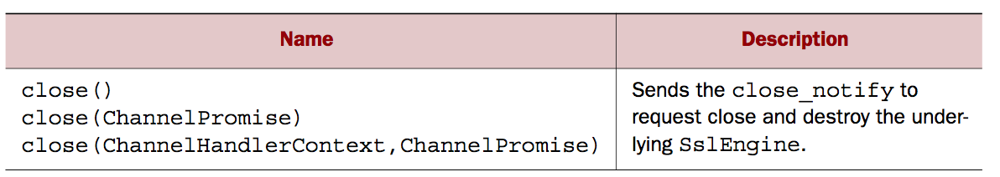
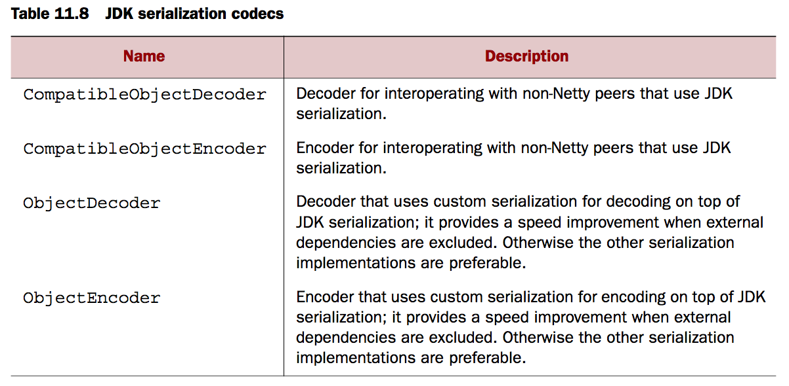

### 简介
netty提供了处理许多的协议，你可以开箱即用，这将减少你的事件与努力，否则你将在此耗费大量的事件，在这章，我们将探索浙西额工具与相关的益处。这包含了对于SSL/TLS以及WebSocket，或者使用压缩简单的提高HTTP更好的性能。

本章主要覆盖
* 使用SSL/TLS安全协议
* 创建netty基于HTTP/HTTPS的应用
* 处理空闲连接以及超时
* 分隔符解码以及基于长度的协议
* 写大量数据

### 使用SSL/TLS加固你的应用安全
数据隐私在今天依然是大家关心的问题，开发者需要提前定位它，最低限度我们应该像加密协议SSL以及TLS，这通常属于数据隐私协议中上层。

为了支持SSL/TLS，java提供了一个包，javax.net.ssl ，SSLContext与SSLEngine使得实现解密与加密是很简单的，Netty提供了Api使用ChannelHandler实现叫做SslHandler，内部使用了SSLEngine内部实现真正的工作


以下展示怎么使用SslHandler添加到pipeline，使用ChannelInitializer来添加

```
public class SslChannelInitializer extends ChannelInitializer<Channel> {
    private final SslContext context;
    private final boolean startTls;

    public SslChannelInitializer(SslContext context,
        boolean startTls) {
        this.context = context;
        this.startTls = startTls;
    }
    @Override
    protected void initChannel(Channel ch) throws Exception {
        SSLEngine engine = context.newEngine(ch.alloc());
        ch.pipeline().addFirst("ssl",
            new SslHandler(engine, startTls));
    }
}
```

使用addFirst 确保SslContext在Pipeline中处于第一个，确保数据加密在后续的所有的ChannelHandlers

SslHandler有一些有用的方法，像下图所展示，在握手期间，两端就会彼此验证，并且基于以上的方法，你可配置SslHandler头修改他们的行为并且提供一些通知，当发生握手完成后，或者在所有的数据加密后




### 创建基于HTTP/HTTPS的应用
HTTP基于请求-响应式的模式，一个HTTP request、response可能包含多个数据块，而且它总司取决于LastHttpContent部分，整个HttpRequest与FullHttpResponse消息被认为是一个特殊的子类型，代表一个完整的请求或者响应。


以下是HTTP的编解码类


以下为增加HTTP协议的示例
```
public class HttpPipelineInitializer extends ChannelInitializer<Channel> {
    private final boolean client;

    public HttpPipelineInitializer(boolean client) {
        this.client = client;
    }

    @Override
    protected void initChannel(Channel ch) throws Exception {
        ChannelPipeline pipeline = ch.pipeline();
        if (client) {
            pipeline.addLast("decoder", new HttpResponseDecoder());
            pipeline.addLast("encoder", new HttpRequestEncoder());
        } else {
            pipeline.addLast("decoder", new HttpRequestDecoder());
            pipeline.addLast("encoder", new HttpResponseEncoder());
        }
    }
}

```

#### HTTP消息聚集
HTTP message聚集，通常一个HTTP消息是比较大的，如果按照传统的方法是很笨重的，必须等到缓存足够的部分组成一个整的HTTP Message消息，netty提供了一种轻量级的操作，因为消息需要缓存知道整个消息组合完成，才会到下一个handler，下面介绍这种自动聚集添加打Pipeline

```
public class HttpAggregatorInitializer extends ChannelInitializer<Channel> {
    private final boolean isClient;

    public HttpAggregatorInitializer(boolean isClient) {
        this.isClient = isClient;
    }

    @Override
    protected void initChannel(Channel ch) throws Exception {
        ChannelPipeline pipeline = ch.pipeline();
        if (isClient) {
            pipeline.addLast("codec", new HttpClientCodec());
        } else {
            pipeline.addLast("codec", new HttpServerCodec());
        }
        pipeline.addLast("aggregator",
                new HttpObjectAggregator(512 * 1024));
    }
}
```

#### HTTP 压缩
当使用HTTP，建议岁大量传输的数据进行压缩，尽管压缩并不会耗费Cpu，但是对于文本数据，通常是一个好主意，netty提供了ChannelHandler实现压缩与加压缩

```
public class HttpCompressionInitializer extends ChannelInitializer<Channel> {
    private final boolean isClient;

    public HttpCompressionInitializer(boolean isClient) {
        this.isClient = isClient;
    }

    @Override
    protected void initChannel(Channel ch) throws Exception {
        ChannelPipeline pipeline = ch.pipeline();
        if (isClient) {
            pipeline.addLast("codec", new HttpClientCodec());
            pipeline.addLast("decompressor",
            new HttpContentDecompressor());
        } else {
            pipeline.addLast("codec", new HttpServerCodec());
            pipeline.addLast("compressor",
            new HttpContentCompressor());
        }
    }
}
```
如果你使用JDK6或者以前的，你需要添加JZLIB，例如maven
```
    <dependency>
        <groupId>com.jcraft</groupId>
        <artifactId>jzlib</artifactId>
        <version>1.1.3</version>
    </dependency>
```
#### 使用HTTPS

```
public class HttpsCodecInitializer extends ChannelInitializer<Channel> {
    private final SslContext context;
    private final boolean isClient;

    public HttpsCodecInitializer(SslContext context, boolean isClient) {
        this.context = context;
        this.isClient = isClient;
    }

    @Override
    protected void initChannel(Channel ch) throws Exception {
        ChannelPipeline pipeline = ch.pipeline();
        SSLEngine engine = context.newEngine(ch.alloc());
        pipeline.addFirst("ssl", new SslHandler(engine));

        if (isClient) {
            pipeline.addLast("codec", new HttpClientCodec());
        } else {
            pipeline.addLast("codec", new HttpServerCodec());
        }
    }
}
```

#### WebSocket
NETTY对基于HTTP应用额扩展工具包括一些比较先进的特点，在这部分我们将探索Websocket

Websocket定位一个存在已久的问题：怎么在HTTP之下实时的发布信息，因为HTTP是一系列的请求-响应交互，ajax提供了一些增强，但是实时流依然是通过client一端进行请求的。这是一种或多或少聪明的方法。但实际上这仍旧是个限制

Websocket明确实现表示了一种尝试更有效的解决方法。简答的开始，一个Websocket提供了“一个简单的TCP连接在两端传输，整合WebSocket，它提供了一种可选的HTTP轮训对于网页端与server端的通讯”


实际上，Websocket提供了一种真正的双向交互数据在client于server端。websocket可以适用于传输任意数据，比正常的socket要好的多


为了让你的应用支持websocket，你需要包含合适的client与server端，WebSocket channelHandler在Pipelien，这个类将会处理特殊的消息格式，叫做frame ，WebSocketFrames


因为netty主要是server端的技术栈，因此我们主要聚焦于创建一个WebSocket server，以下展示一个使用WebSocketServerProtocolHandler ,这个类将会处理协议升级握手，一般是三种控制frames ：close、Ping、Pong


```
public class WebSocketServerInitializer extends ChannelInitializer<Channel> {
    @Override
    protected void initChannel(Channel ch) throws Exception {
        ch.pipeline().addLast(
            new HttpServerCodec(),
            new HttpObjectAggregator(65536),
            new WebSocketServerProtocolHandler("/websocket"),
            new TextFrameHandler(),
            new BinaryFrameHandler(),
            new ContinuationFrameHandler());
    }

    public static final class TextFrameHandler extends
        SimpleChannelInboundHandler<TextWebSocketFrame> {
        @Override
        public void channelRead0(ChannelHandlerContext ctx,
            TextWebSocketFrame msg) throws Exception {
            // Handle text frame
        }
    }

    public static final class BinaryFrameHandler extends
        SimpleChannelInboundHandler<BinaryWebSocketFrame> {
        @Override
        public void channelRead0(ChannelHandlerContext ctx,
            BinaryWebSocketFrame msg) throws Exception {
            // Handle binary frame
        }
    }

    public static final class ContinuationFrameHandler extends
        SimpleChannelInboundHandler<ContinuationWebSocketFrame> {
        @Override
        public void channelRead0(ChannelHandlerContext ctx,
            ContinuationWebSocketFrame msg) throws Exception {
            // Handle continuation frame
        }
    }
}
```


### 闲置连接以及超时


让我们先看一下IdleStateHandler，在实践中查看怎么样在60s没有接到数据会通知，使用一个通用的方法发送心跳给远端，如果没有回应，链接会会被关闭

```
public class IdleStateHandlerInitializer extends ChannelInitializer<Channel>
    {
    @Override
    protected void initChannel(Channel ch) throws Exception {
        ChannelPipeline pipeline = ch.pipeline();
        pipeline.addLast(
                new IdleStateHandler(0, 0, 60, TimeUnit.SECONDS));
        pipeline.addLast(new HeartbeatHandler());
    }

    public static final class HeartbeatHandler
        extends ChannelInboundHandlerAdapter {
        private static final ByteBuf HEARTBEAT_SEQUENCE =
                Unpooled.unreleasableBuffer(Unpooled.copiedBuffer(
                "HEARTBEAT", CharsetUtil.ISO_8859_1));
        @Override
        public void userEventTriggered(ChannelHandlerContext ctx,
            Object evt) throws Exception {
            if (evt instanceof IdleStateEvent) {
                ctx.writeAndFlush(HEARTBEAT_SEQUENCE.duplicate())
                     .addListener(
                         ChannelFutureListener.CLOSE_ON_FAILURE);
            } else {
                super.userEventTriggered(ctx, evt);
            }
        }
    }
}
```

### 解码分隔符以及基于长度的协议

#### 基于分割符
如果你工作中使用Netty，你可能已经使用过分隔符以及基于长度的协议解码，下一部分主要解释netty提供给的实现

分隔符消息协议主要使用已经定义好的字符来定位消息的开头与结尾。通常一个消息叫做frame，通常这种协议由RFC来定义：SMTP、POP3、IMAP、以及TELNET，当然私有组织也会使用它们自己合适的格式。


```
public class LineBasedHandlerInitializer extends ChannelInitializer<Channel>
    {
    @Override
    protected void initChannel(Channel ch) throws Exception {
        ChannelPipeline pipeline = ch.pipeline();
        pipeline.addLast(new LineBasedFrameDecoder(64 * 1024));
        pipeline.addLast(new FrameHandler());
    }

    public static final class FrameHandler
        extends SimpleChannelInboundHandler<ByteBuf> {
        @Override
        public void channelRead0(ChannelHandlerContext ctx,
            ByteBuf msg) throws Exception {
            // Do something with the data extracted from the frame
        }
    }
}
```
使用一个cmd命令来实践

```
public class CmdHandlerInitializer extends ChannelInitializer<Channel> {
    private static final byte SPACE = (byte)' ';
    @Override
    protected void initChannel(Channel ch) throws Exception {
        ChannelPipeline pipeline = ch.pipeline();
        pipeline.addLast(new CmdDecoder(64 * 1024));
        pipeline.addLast(new CmdHandler());
    }

    public static final class Cmd {
        private final ByteBuf name;
        private final ByteBuf args;

        public Cmd(ByteBuf name, ByteBuf args) {
            this.name = name;
            this.args = args;
        }

        public ByteBuf name() {
            return name;
        }

        public ByteBuf args() {
            return args;
        }
    }

    public static final class CmdDecoder extends LineBasedFrameDecoder {
        public CmdDecoder(int maxLength) {
            super(maxLength);
        }

        @Override
        protected Object decode(ChannelHandlerContext ctx, ByteBuf buffer)
            throws Exception {
            ByteBuf frame = (ByteBuf) super.decode(ctx, buffer);
            if (frame == null) {
                return null;
            }
            int index = frame.indexOf(frame.readerIndex(),
                    frame.writerIndex(), SPACE);
            return new Cmd(frame.slice(frame.readerIndex(), index),
                    frame.slice(index + 1, frame.writerIndex()));
        }
    }

    public static final class CmdHandler
        extends SimpleChannelInboundHandler<Cmd> {
        @Override
        public void channelRead0(ChannelHandlerContext ctx, Cmd msg)
            throws Exception {
            // Do something with the command
        }
    }
}
```

#### 基于固定长度


```
public class LengthBasedInitializer extends ChannelInitializer<Channel> {
    @Override
    protected void initChannel(Channel ch) throws Exception {
        ChannelPipeline pipeline = ch.pipeline();
        pipeline.addLast(
                new LengthFieldBasedFrameDecoder(64 * 1024, 0, 8));
        pipeline.addLast(new FrameHandler());
    }

    public static final class FrameHandler
        extends SimpleChannelInboundHandler<ByteBuf> {
        @Override
        public void channelRead0(ChannelHandlerContext ctx,
             ByteBuf msg) throws Exception {
            // Do something with the frame
        }
    }
}
```


### 写大数据（大量数据）

在异步框架中有效率的写比较大块的数据是一个问题，因为可能网络饱和等元in。因为写操作是非阻塞的，他们在操作后返回通知，几遍所有的数据还没有被写完。当这种情况发生的时候，如果你没有停止写可能就会发生oom，因此当在网络不好的情况下，向远端写数据时，要注意可能导致的delay

在我们讨论传输的时候，我们注意到领拷贝的特点在NIO中，它在移动文件数据到网络栈的时候排除了拷贝文件内容那一步。这个在NEtty中也是提供的，你只需要实现FileRegion接口，他定义了一个文件部分通过channel传输是领拷贝的。

```
public class FileRegionWriteHandler extends ChannelInboundHandlerAdapter {
    private static final Channel CHANNEL_FROM_SOMEWHERE = new NioSocketChannel();
    private static final File FILE_FROM_SOMEWHERE = new File("");

    @Override
    public void channelActive(final ChannelHandlerContext ctx) throws Exception {
        File file = FILE_FROM_SOMEWHERE; //get reference from somewhere
        Channel channel = CHANNEL_FROM_SOMEWHERE; //get reference from somewhere
        //...
        FileInputStream in = new FileInputStream(file);
        FileRegion region = new DefaultFileRegion(
                in.getChannel(), 0, file.length());
        channel.writeAndFlush(region).addListener(
            new ChannelFutureListener() {
            @Override
            public void operationComplete(ChannelFuture future)
               throws Exception {
               if (!future.isSuccess()) {
                   Throwable cause = future.cause();
                   // Do something
               }
            }
        });
    }
}
```


如果你需要拷贝文件内容到用户空间，你也可以使用ChunkedWriteHandler,它提供了异步写大数据流且不会导致oom

关键要点在于接口 ChunkedInput<B> ,这个B是方法readChunk()返回的类型，


```
public class ChunkedWriteHandlerInitializer
    extends ChannelInitializer<Channel> {
    private final File file;
    private final SslContext sslCtx;
    public ChunkedWriteHandlerInitializer(File file, SslContext sslCtx) {
        this.file = file;
        this.sslCtx = sslCtx;
    }

    @Override
    protected void initChannel(Channel ch) throws Exception {
        ChannelPipeline pipeline = ch.pipeline();
        pipeline.addLast(new SslHandler(sslCtx.newEngine(ch.alloc())));
        pipeline.addLast(new ChunkedWriteHandler());
        pipeline.addLast(new WriteStreamHandler());
    }

    public final class WriteStreamHandler
        extends ChannelInboundHandlerAdapter {

        @Override
        public void channelActive(ChannelHandlerContext ctx)
            throws Exception {
            super.channelActive(ctx);
            ctx.writeAndFlush(
            new ChunkedStream(new FileInputStream(file)));
        }
    }
}

```

### 序列化数据
#### JDk

通常JDK提供了ObjectOutputStream、ObjectInputStream用于序列化与反序列化数据，这个Api并不复杂，适用于实现了java.io.Serializable,但是它的效率并不高



#### 使用Jboss Marshalling
JBoss Mashalling比Jdk原生的快3倍，并且兼容JDK序列化


```
public class MarshallingInitializer extends ChannelInitializer<Channel> {
    private final MarshallerProvider marshallerProvider;
    private final UnmarshallerProvider unmarshallerProvider;

    public MarshallingInitializer(
            UnmarshallerProvider unmarshallerProvider,
            MarshallerProvider marshallerProvider) {
        this.marshallerProvider = marshallerProvider;
        this.unmarshallerProvider = unmarshallerProvider;
    }

    @Override
    protected void initChannel(Channel channel) throws Exception {
        ChannelPipeline pipeline = channel.pipeline();
        pipeline.addLast(new MarshallingDecoder(unmarshallerProvider));
        pipeline.addLast(new MarshallingEncoder(marshallerProvider));
        pipeline.addLast(new ObjectHandler());
    }

    public static final class ObjectHandler
        extends SimpleChannelInboundHandler<Serializable> {
        @Override
        public void channelRead0(
            ChannelHandlerContext channelHandlerContext,
            Serializable serializable) throws Exception {
            // Do something
        }
    }
}
```

#### 使用Google Protocol Buffers来实现
这是一个google开源的序列化codec，适用于跨语言的编程中，并且也是很有效率且坚固的。


```
public class ProtoBufInitializer extends ChannelInitializer<Channel> {
    private final MessageLite lite;

    public ProtoBufInitializer(MessageLite lite) {
        this.lite = lite;
    }

    @Override
    protected void initChannel(Channel ch) throws Exception {
        ChannelPipeline pipeline = ch.pipeline();
        pipeline.addLast(new ProtobufVarint32FrameDecoder());
        pipeline.addLast(new ProtobufEncoder());
        pipeline.addLast(new ProtobufDecoder(lite));
        pipeline.addLast(new ObjectHandler());
    }

    public static final class ObjectHandler
        extends SimpleChannelInboundHandler<Object> {
        @Override
        public void channelRead0(ChannelHandlerContext ctx, Object msg)
            throws Exception {
            // Do something with the object
        }
    }
}
```


### 总结
本章介绍了netty提供的codecs以及handlers的组合与扩展实现一个比较大范围的情况，更多的，他们可以提升以及增强很多大型系统的组件

我们将在下一张学习另一种比较先进的协议，提升我们的性能：WebSocket,netty提供了你可以快速以及容易利用其强大的能力的工具。

