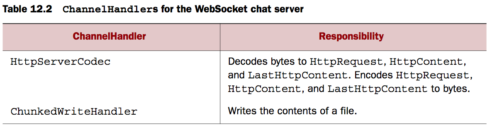
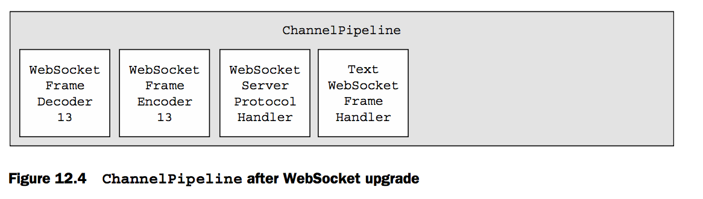

### 介绍websocket
websocket被设计成提供一个实际的解决方法对于双向通讯的web，它允许client与server在任何时候传输信息。因此，要求他们处理消息接收是异步的

netty支持websocket包括所有的最重要的实现，因此他可以直接适配你的应用。通常，你可以直接实现而不用关心内部的实现细节。我们将示范这个机遇websocket的实时聊天室。


### 添加websocket支持
升级握手（upgrade handshake）这种机制用于切换标准的HTTP/HTTPS协议，因此一个应用使用websocket将开始使用HTTP/S以及达成这种升级。当发生在这种应用的情况下，它可能开始于一个特定的url

我们的应用将会适应这种转换，如果一个url请求以/ws结尾，我们将要更新这个协议为websocket，否则这个服务将仍旧会使用基础的HTTP/S协议。当这个连接升级后，所有的数据将会以websocket来传输。

#### 处理HTTP 请求
首先我们实现HTTP 请求，这部分将会服务聊天室的接入以及展示接收到消息到所有已经连接的client


```
public class HTTPRequestHandler extends SimpleChannelInboundHandler<FullHttpRequest> {


    private final String wsUri;
    private static final File INDEX;

    static {
        URL location=HTTPRequestHandler.class.getProtectionDomain().getCodeSource().getLocation();
        String path= null;
        try {
            path = location.toURI()+"index.html";
            System.out.println("path:"+path);
            path=!path.contains("file:")?path:path.substring(5);
            INDEX=new File(path);
        } catch (URISyntaxException e) {
            throw new IllegalStateException("unable to locate index.html",e);
        }
    }


    public HTTPRequestHandler(String wsUri) {
        this.wsUri = wsUri;
    }

    @Override
    protected void channelRead0(ChannelHandlerContext channelHandlerContext, FullHttpRequest request) throws Exception {
        if(wsUri.equalsIgnoreCase(request.getUri())){
            channelHandlerContext.fireChannelRead(request.retain());
        }else {
            if (HttpHeaders.is100ContinueExpected(request)){
                    send100Continue(channelHandlerContext);
            }
            RandomAccessFile file=new RandomAccessFile(INDEX,"r");
            HttpResponse response=new DefaultHttpResponse(request.getProtocolVersion(),HttpResponseStatus.OK);
            response.headers().set(HttpHeaders.Names.CONTENT_TYPE,"text/plain; charset=UTF-8");
            boolean keepAlive=HttpHeaders.isKeepAlive(request);
            if (keepAlive){
                response.headers().set(HttpHeaders.Names.CONTENT_LENGTH, file.length());
                response.headers().set(HttpHeaders.Names.CONNECTION,HttpHeaders.Values.KEEP_ALIVE);
            }
            channelHandlerContext.write(response);
            if (channelHandlerContext.pipeline().get(SslHandler.class) == null){
                channelHandlerContext.write(new DefaultFileRegion(file.getChannel(),0,file.length()));
            }else {
                channelHandlerContext.write(new ChunkedNioFile(file.getChannel()));
            }

            ChannelFuture future=channelHandlerContext.writeAndFlush(LastHttpContent.EMPTY_LAST_CONTENT);
            if (!keepAlive){
                future.addListener(ChannelFutureListener.CLOSE);
            }

        }
    }


    private static void send100Continue(ChannelHandlerContext ctx) {
        FullHttpResponse response = new DefaultFullHttpResponse(
                HttpVersion.HTTP_1_1, HttpResponseStatus.CONTINUE);
        ctx.writeAndFlush(response);
    }


}
```


#### 处理websocket


```
public class TextWebsocketFrameHandler extends SimpleChannelInboundHandler<TextWebSocketFrame> {
    private final ChannelGroup group;


    public TextWebsocketFrameHandler(ChannelGroup group) {
        this.group = group;
    }


    @Override
    public void userEventTriggered(ChannelHandlerContext ctx, Object evt) throws Exception {
        if (evt == WebSocketServerProtocolHandler.ServerHandshakeStateEvent.HANDSHAKE_COMPLETE){
            ctx.pipeline().remove(HTTPRequestHandler.class);
            group.writeAndFlush(new TextWebSocketFrame("clinet "+ctx.channel()+" joined"));
            group.add(ctx.channel());
        }else {
            super.userEventTriggered(ctx, evt);
        }

    }

    @Override
    protected void channelRead0(ChannelHandlerContext channelHandlerContext, TextWebSocketFrame textWebSocketFrame) throws Exception {
        group.writeAndFlush(textWebSocketFrame.retain());
    }
}
```

#### 初始化Pipeline

```
public class ChatServerInitializer extends ChannelInitializer<Channel> {

    private final ChannelGroup group;

    public ChatServerInitializer(ChannelGroup group) {
        this.group = group;
    }

    @Override
    protected void initChannel(Channel channel) throws Exception {
        ChannelPipeline pipeline = channel.pipeline();
        pipeline.addLast(new HttpServerCodec());
        pipeline.addLast(new ChunkedWriteHandler());
        pipeline.addLast(new HttpObjectAggregator(64*1024));
        pipeline.addLast(new HTTPRequestHandler("/ws"));
        pipeline.addLast(new WebSocketServerProtocolHandler("/ws"));
        pipeline.addLast(new TextWebsocketFrameHandler(group));
    }
}
```




初始化时候的pipeline


当整个协议升级为websocket时，WebSocketServerProtocolHandler将会替换HttpServerCodec为对应的websocket的codec，为了最大化的性能，他将会在pipeline中去除其他对于websocket无用的handler

协议升级为websocket后


#### BootStraping初始配置

```
public class ChatServer {
    private final ChannelGroup channelGroup=new DefaultChannelGroup(ImmediateEventExecutor.INSTANCE);
    private final EventLoopGroup group=new NioEventLoopGroup();
    private Channel channel;

    public ChannelFuture start(InetSocketAddress address){
        ServerBootstrap bootstrap=new ServerBootstrap();
        bootstrap.group(group)
                .channel(NioServerSocketChannel.class)
                .childHandler(createInitializer(channelGroup));
        ChannelFuture future = bootstrap.bind(address);
        future.syncUninterruptibly();
        channel=future.channel();
        return future;

    }


    public void destroy(){
        if (channel!=null){
            channel.close();
        }
        channelGroup.close();
        group.shutdownGracefully();
    }


    protected ChannelInitializer<Channel> createInitializer(ChannelGroup group){
        return new ChatServerInitializer(group);
    }

    public static void main(String[] args) {
//        if (args.length!=1){
//            System.err.println("please give port as argument");
//            System.exit(1);
//        }

        //int port=Integer.parseInt(args[0]);
        int port=8090;
        final ChatServer  server=new ChatServer();
        ChannelFuture future = server.start(new InetSocketAddress(port));
        Runtime.getRuntime().addShutdownHook(new Thread(){
            @Override
            public void run() {
                server.destroy();
            }
        });
        future.channel().closeFuture().syncUninterruptibly();

    }


}
```


### 什么是加密 encryption

在这种实时传输的整个周期中，怎么保证能整合到netty的应用中

```
public class SecureChatServerInitializer extends ChatServerInitializer {

    private final SslContext context;

    public SecureChatServerInitializer(ChannelGroup group,SslContext context) {
        super(group);
        this.context=context;

    }

    @Override
    protected void initChannel(Channel channel) throws Exception {
      super.initChannel(channel);
        SSLEngine engine = context.newEngine(channel.alloc());
        channel.pipeline().addFirst(new SslHandler(engine));
    }
}
```

```
public class SecureChatServer  extends ChatServer{
    private final SslContext context;

    public SecureChatServer(SslContext context) {
        this.context = context;
    }


    @Override
    protected ChannelInitializer<Channel> createInitializer(ChannelGroup group) {
        return new SecureChatServerInitializer(group,context);
    }


    public static void main(String[] args)  {
        try {

        int port=8099;
        SelfSignedCertificate cert=new SelfSignedCertificate();
        SslContext context=SslContext.newServerContext(cert.certificate(),cert.privateKey());
        final  SecureChatServer endpoint=new SecureChatServer(context);
        ChannelFuture future = endpoint.start(new InetSocketAddress(port));
        Runtime.getRuntime().addShutdownHook(new Thread(){
            @Override
            public void run() {
                endpoint.destroy();
            }
        });
        future.channel().closeFuture().syncUninterruptibly();

        }catch (CertificateException e) {
            e.printStackTrace();
        } catch (SSLException e) {
            e.printStackTrace();
        }
    }


}
```


### 总结
本章主要用于怎么使用Netty的websocket实现管理你的web应用。我们将覆盖所有支持的数据类型。

