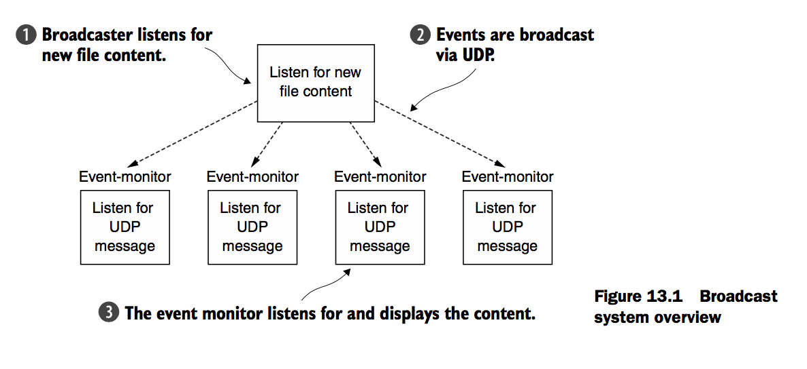

### 简介
本章主要是对UDP的概述，以及一个简单的广播例子

前面的例子都是基于TCP，但是这章我们主要使用UDP来实现

### UDP基础
无连接的协议例如：UDP，并没有相关连接的概念，而且每条消息都是独立的传输。

更多，UDP与TCP相比没有错误-正确的机制，每个端只知道它自己接收的数据，并不会告诉对端这些内容

类似的，一个TCP连接就像打电话，是一系列的有序的消息流在两端，UDP相反，就像在信箱中的明信片一样，你不知道他们在对端发出的顺序。即便他们所有的消息已经到达。

UDP的这些方面可能使得你有一个比较严肃的限制，但是他们总是解释：为什么会比TCP快很多，毕竟UDP是一个很好的应用适配可以处理容忍丢失数据的系统。


### UDP 广播

* Multicast 传输信息到定义的host组
* Broadcast 传输信息到所有的hosts以及子网

我们将会通过发送消息到地址 255.255.255.255，这个地址将会把消息发送到所有的hosts

### UDP样例应用

我们将会读取一个文件，并把每行通过UDP发送。这个场景可以允许有些许消息的丢失。



### message pojo:LogEvent

在消息应用中，数据通常用一个pojo来表示，它通常配置并且处理信息在额外的消息内容上。在这个应用中我们通常经处理消息作为一个事件，并且因为数据是来自于log file，我们通常叫做LogEvent

```
public final class LogEvent {
    public static final byte SEPARATOR = (byte) ':';
    private final InetSocketAddress source;
    private final String logfile;
    private final String msg;
    private final long received;

    public LogEvent(String logfile, String msg) {
        this(null, -1, logfile, msg);
    }

    public LogEvent(InetSocketAddress source, long received,
        String logfile, String msg) {
        this.source = source;
        this.logfile = logfile;
        this.msg = msg;
        this.received = received;
    }

    public InetSocketAddress getSource() {
        return source;
    }

    public String getLogfile() {
        return logfile;
    }

    public String getMsg() {
        return msg;
    }

    public long getReceivedTimestamp() {
        return received;
    }
}

```

### 写一个广播
以下为netty提供的一些用于UDP的类


Netty的DatagramPacket是一个简单的消息容器，DatagramChannel实现与远端通讯，为了转换EventLog为DatagramPackets,我们需要一个编码器，但这个并不需要我们临时拼凑。我们可以继承Netty的MessageToMessageEncoder


上图表示了一种高级别的展示：ChannelPipeline 通过LogEvent广播，展示了LogEvent流怎么通过的。

你可以按到，所有的数据被被包含在LogEvent message中，LogEventBroadcaster写这些数据到通道，并发送他们。最终转换为DatagramPacket消息。最终我们通过UDP发送到远端。


### 写监控 monitor
这个目标主要是替代netcat实现日志事件的监控
* 接受UDP包的广播
* 解码LogEvent Message
* 写LogEvent message 到标准输出


```
public class LogEventDecoder extends MessageToMessageDecoder<DatagramPacket> {

    @Override
    protected void decode(ChannelHandlerContext channelHandlerContext, DatagramPacket datagramPacket, List<Object> list) throws Exception {
        ByteBuf data = datagramPacket.content();
        int idx = data.indexOf(0, data.readableBytes(), LogEvent.SEPARATOR);
        String filename = data.slice(0, idx).toString(CharsetUtil.UTF_8);
        String logmsg = data.slice(idx + 1, data.readableBytes()).toString(CharsetUtil.UTF_8);
        LogEvent event = new LogEvent(datagramPacket.sender(), System.currentTimeMillis(), filename, logmsg);
        list.add(event);

    }
}
```

channelHandler编写
```
public class LogEventHandler extends SimpleChannelInboundHandler<LogEvent> {
    @Override
    protected void channelRead0(ChannelHandlerContext channelHandlerContext, LogEvent event) throws Exception {
        StringBuilder builder = new StringBuilder();
        builder.append(event.getReceivedTimestamp());
        builder.append(" [");
        builder.append(event.getSource().toString());
        builder.append("] [");
        builder.append(event.getLogfile());
        builder.append("] : ");
        builder.append(event.getMsg());
        System.out.println(builder.toString());
    }


    @Override
    public void exceptionCaught(ChannelHandlerContext ctx, Throwable cause) throws Exception {
        cause.printStackTrace();
        ctx.close();
    }
}

```
这个是监控端
```
public class LogEventMonitor {

    private final EventLoopGroup group;
    private final Bootstrap bootstrap;

    public LogEventMonitor(InetSocketAddress address) {
        this.group = new NioEventLoopGroup();
        this.bootstrap=new Bootstrap();
        bootstrap.group(group)
                .channel(NioDatagramChannel.class)
                .option(ChannelOption.SO_BROADCAST,true)
                .handler(new ChannelInitializer<Channel>() {
                    @Override
                    protected void initChannel(Channel channel) throws Exception {
                        ChannelPipeline pipeline = channel.pipeline();
                    pipeline.addLast(new LogEventDecoder());
                    pipeline.addLast(new LogEventHandler());
                    }
                })
                .localAddress(address);

    }


    public Channel bind(){
        try {
            return bootstrap.bind().sync().channel();
        } catch (InterruptedException e) {
            e.printStackTrace();
        }
        return null;
    }


    public void stop(){
        group.shutdownGracefully();

    }


    public static void main(String[] args) {
        LogEventMonitor monitor=new LogEventMonitor(new InetSocketAddress(8098));
        Channel ch = monitor.bind();
        System.out.println("绑定成功");
        try {
            ch.closeFuture().sync();
        } catch (InterruptedException e) {
            e.printStackTrace();
        }finally {
            monitor.stop();
        }

    }


}
```


