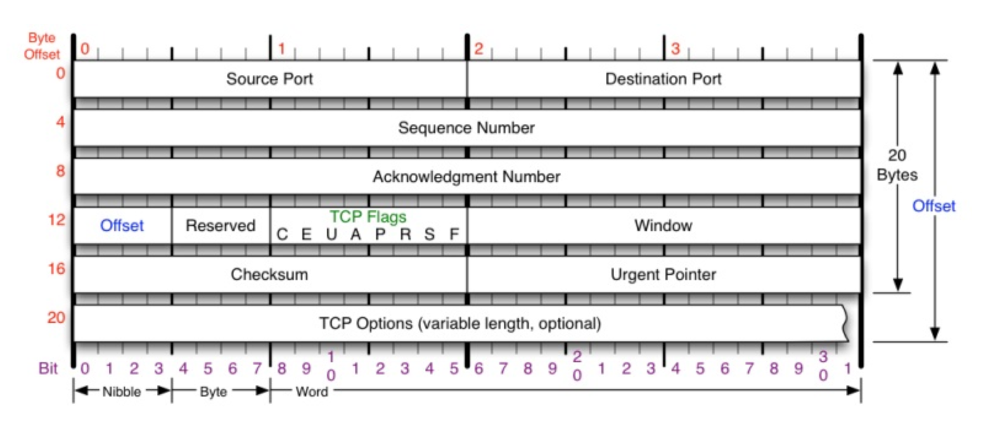
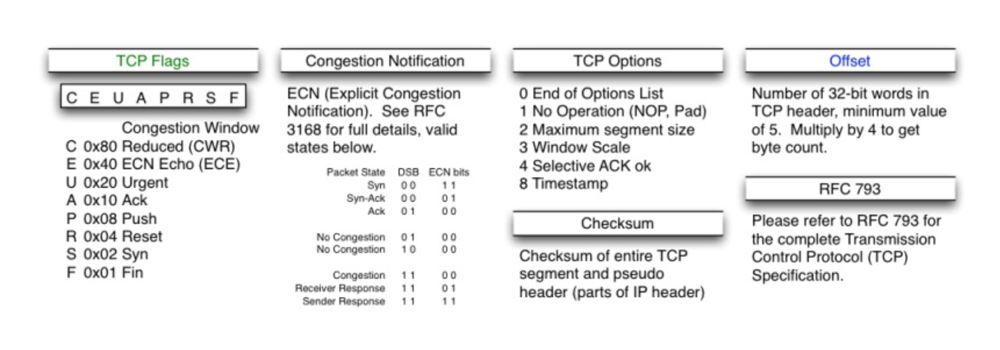

> 本文主要参考、copy陈皓老师的tcp那些事儿，再此谢谢陈皓老师


### 简介
tcp在网络OSI的七层模型中第四层--transport层，ip在第三层--network层，Arp在第二层--data link层，在第二层的数据，我们叫Frame，在第三层的数据我们叫Packet，第四层的数据叫segment

### 数据流向
数据 -> tcp(segment) -> ip(packet) -> data link(frame) 
每个层解析自己的协议，数据交给上层


### Tcp头格式


<center>tcp头部</center>

* tcp头部没有ip地址，那个是ip层的事，tcp包含源端口、与目标端口

> 一个tcp连接需要源ip、目标ip、源端口、目标端口、以及协议才能表示同一个连接
* sequence number:包序号，解决网络包乱序问题
* acknowledgement number: 就是ack，用来确认收到消息，解决不丢包的问题
* window ：advertised-window ，滑动窗口，解决流控
* tcp flag：包类型，操控tcp的状态机


<center>tcp头部其他定义</center>

### tcp的状态机
网络上的传输是没有连接的，包括TCP也是一样的。而TCP所谓的“连接”，其实只不过是在通讯的双方维护一个“连接状态”，让它看上去好像有连接一样。所以，TCP的状态变换是非常重要的


<center>tcp状态机</center>


<center>tcp开始关闭示意图</center>


#### tcb
在网络传输层，tcp模块中有一个tcb（传输控制模块，transmit control block），它用于记录tcp协议运行过程中的 变量。对于有多个连接的tcp，每个连接都有一个tcb。tcb结构的定义包括这个连接使用 的源端口、目的端口、目的ip、序号、应答序号、对方窗口大小、己方窗口大小、tcp状态、top输入/输出队列、应用层输出队列、tcp的重传有关变量。


#### 对于建链接的3次握手
主要是要初始化Sequence Number 的初始值。通信的双方要互相通知对方自己的初始化的Sequence Number（缩写为ISN：Inital Sequence Number）——所以叫SYN，全称Synchronize Sequence Numbers。也就上图中的 x 和 y。这个号要作为以后的数据通信的序号，以保证应用层接收到的数据不会因为网络上的传输的问题而乱序（TCP会用这个序号来拼接数据）。
#### 对于4次挥手
其实你仔细看是2次，因为TCP是全双工的，所以，发送方和接收方都需要Fin和Ack。只不过，有一方是被动的，所以看上去就成了所谓的4次挥手。如果两边同时断连接，那就会就进入到CLOSING状态，然后到达TIME_WAIT状态。下图是双方同时断连接的示意图（你同样可以对照着TCP状态机看）


<center>tcp同步关闭示意图</center>


### tcp重传机制
#### 超时重传机制
不回ack，死等，当发现方发现收不到ack的超时后，会重传3，有严重的性能问题，会导致多次重传

#### 快速重传机制
tcp引入了一种叫做fast retransmit的算法，以数据为驱动，不以时间为驱动，解决了timeout的问题
> 如果某个包没有连续到达，就ack最后那个可能被丢了的包，如果发送方连续收到三次相同的ack，就重传--好处是不用等到timeout再重传

##### 问题
如果发送发送多个对端，发现三次的ack传来，并不知道是一个对端、还是三个对端，这个时候，是重传丢失的，还是丢失后的都要传

#### sack方法
Selective Acknowledgment (SACK)，在tcp头里面加入sack的东西，ACK还是Fast Retransmit的ACK，SACK则是汇报收到的数据碎版
这个协议需要两边都支持，因此在 Linux下，可以通过tcp_sack参数打开这个功能（Linux 2.4后默认打开


<center>tcp-Sack示意图</center>

##### 问题
* 问题——接收方Reneging
所谓Reneging的意思就是接收方有权把已经报给发送端SACK里的数据给丢了。这样干是不被鼓励的，因为这个事会把问题复杂化了，但是，接收方这么做可能会有些极端情况，比如要把内存给别的更重要的东西。所以，发送方也不能完全依赖SACK，还是要依赖ACK，并维护Time-Out，如果后续的ACK没有增长，那么还是要把SACK的东西重传，另外，接收端这边永远不能把SACK的包标记为Ack。

* 问题——性能问题
SACK会消费发送方的资源，试想，如果一个攻击者给数据发送方发一堆SACK的选项，这会导致发送方开始要重传甚至遍历已经发出的数据，这会消耗很多发送端的资源。

#### Duplicate SACK – 重复收到数据的问题
Linux下的tcp_dsack参数用于开启这个功能（Linux 2.4后默认打开）

D-SACK使用了SACK的第一个段来做标志，
如果SACK的第一个段的范围被ACK所覆盖，那么就是D-SACK
如果SACK的第一个段的范围被SACK的第二个段覆盖，那么就是D-SACK

* 示例一：ACK丢包

下面的示例中，丢了两个ACK，所以，发送端重传了第一个数据包（3000-3499），于是接收端发现重复收到，于是回了一个SACK=3000-3500，因为ACK都到了4000意味着收到了4000之前的所有数据，所以这个SACK就是D-SACK——旨在告诉发送端我收到了重复的数据，而且我们的发送端还知道，数据包没有丢，丢的是ACK包。

```
Transmitted  Received    ACK Sent
Segment      Segment     (Including SACK Blocks)
 
3000-3499    3000-3499   3500 (ACK dropped)
3500-3999    3500-3999   4000 (ACK dropped)
3000-3499    3000-3499   4000, SACK=3000-3500
```


* 示例二: 网络延误

下面的示例中，网络包（1000-1499）被网络给延误了，导致发送方没有收到ACK，而后面到达的三个包触发了“Fast Retransmit算法”，所以重传，但重传时，被延误的包又到了，所以，回了一个SACK=1000-1500，因为ACK已到了3000，所以，这个SACK是D-SACK——标识收到了重复的包。

这个案例下，发送端知道之前因为“Fast Retransmit算法”触发的重传不是因为发出去的包丢了，也不是因为回应的ACK包丢了，而是因为网络延时了。

```
Transmitted    Received    ACK Sent
Segment        Segment     (Including SACK Blocks)
 
500-999        500-999     1000
1000-1499      (delayed)
1500-1999      1500-1999   1000, SACK=1500-2000
2000-2499      2000-2499   1000, SACK=1500-2500
2500-2999      2500-2999   1000, SACK=1500-3000
1000-1499      1000-1499   3000
               1000-1499   3000, SACK=1000-1500
```

* 优点
1）可以让发送方知道，是发出去的包丢了，还是回来的ACK包丢了。

2）是不是自己的timeout太小了，导致重传。

3）网络上出现了先发的包后到的情况（又称reordering）

4）网络上是不是把我的数据包给复制了。


### 名词解释
* msl ：max segment lifetime    tpc segment在网络上的存活时间
* isn ：init sequence number    初始化序列数字
* time_wait: 确保有足够时间让对端收到ack，一来一回两个msl ，因此超时设置为2*msl
* FIN ：finish 表示关闭连接
* tcp_max_tw_buckets ： time_wait的最大数量，默认为180000


### 最佳实践
#### 处理大负载连接
调整三个TCP参数可供你选择，第一个是：tcp_synack_retries 可以用他来减少重试次数；第二个是：tcp_max_syn_backlog，可以增大SYN连接数；第三个是：tcp_abort_on_overflow 处理不过来干脆就直接拒绝连接了。

tcp_tw_reuse和tcp_tw_recycle来解决TIME_WAIT的问题是非常非常危险的，因为这两个参数违反了TCP协议
